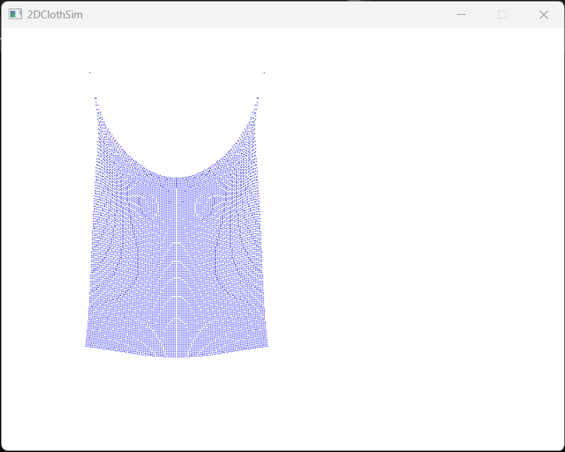

# 2DClothSim

- Dependencies: SDL2

Very basic mass-spring system based cloth simulation

[Video](https://drive.google.com/file/d/1yFuUO0anQhsLciZ7u4gIyal2JUjLY242/view?usp=sharing)

### Installation:

Install SDL2 on your machine and set the `SDL_DIR` CMake variable accordingly

Configure and build the project using CMake

### Issues:

This was developed on Windows using the MSVC compiler. If Linux or Mac users encounter any issues with g++ or clang, please open an issue.

